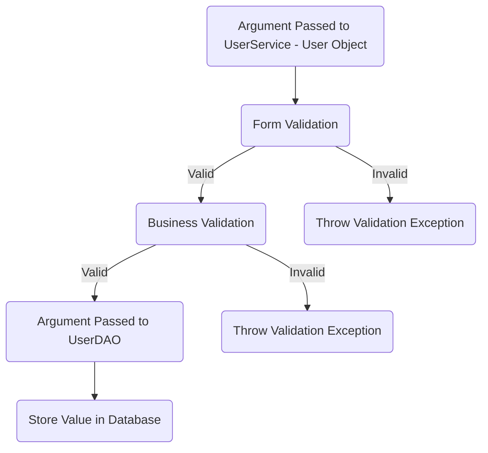
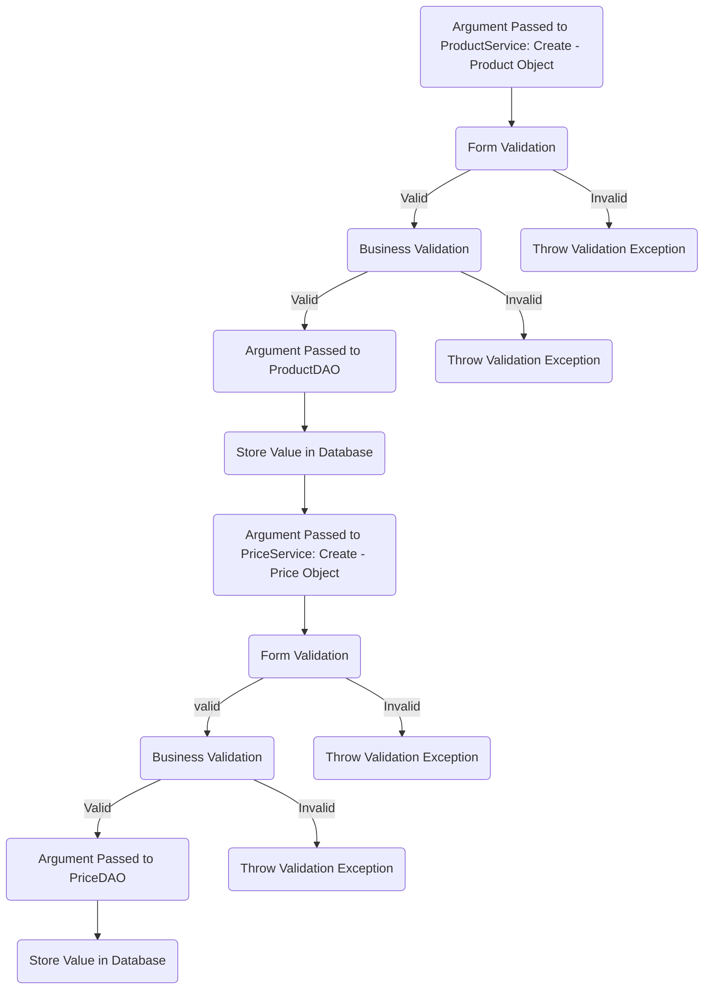
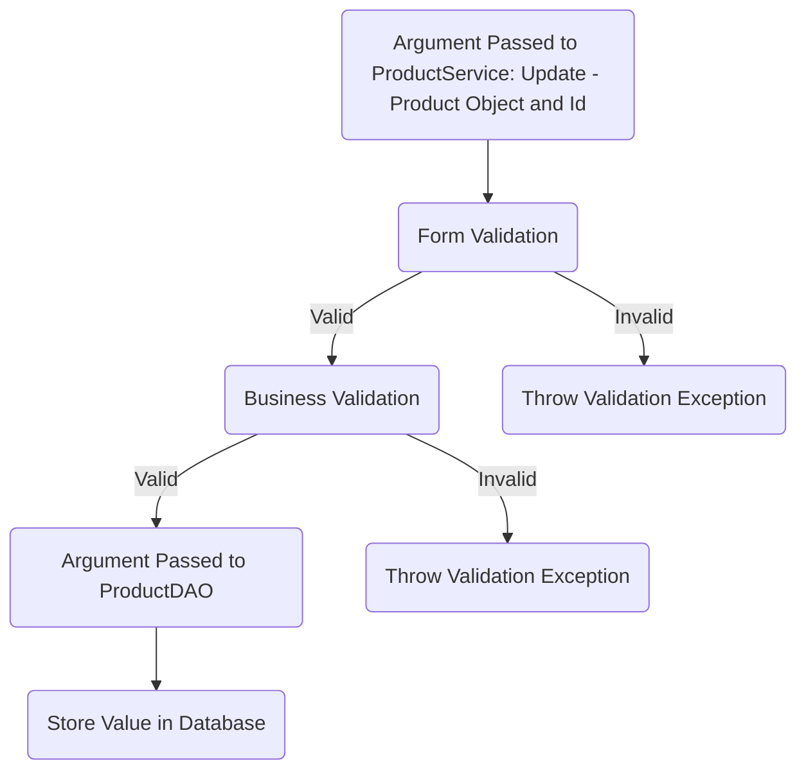
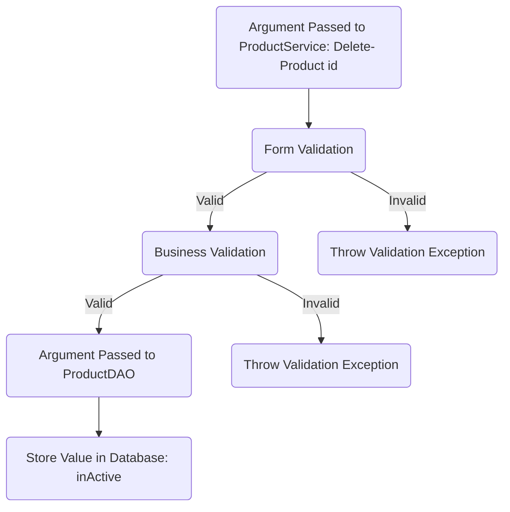
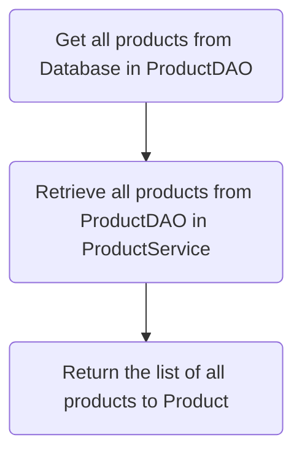
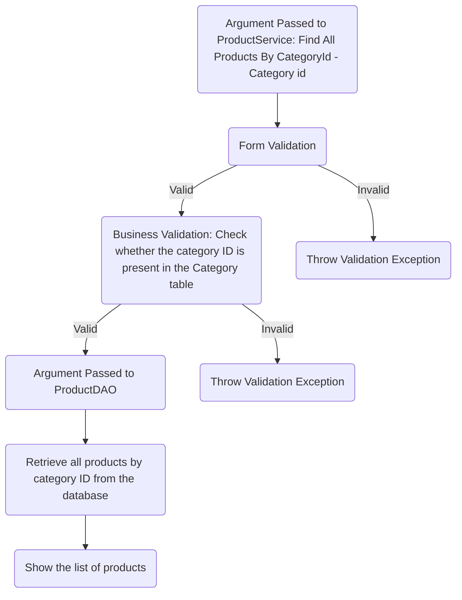

# E-Commerce(Fert Agri Boomi) Application Checklist

## Database Design
- [ ] ER diagram of the database![\] ](https://iili.io/JqH2kTN.png)
- [ ] Table scripts: [script](/src/main/resources/db/migration/V1__create_users.sql)

## Project Setup

- [ ] Create a new Java project
- [ ] Set up a MySQL database
- [ ] Add necessary libraries
	- [ ] JDBC, 
	- [ ] MySQL Connector, 
	- [ ] JUnit, 
	- [ ] Dotenv

## Module: User

### Feature: Create User

>Create a new user in a database.
#### Pre-requisites:
- [ ] user table
- [ ] user model
- [ ]  user DAO( create )
- [ ]  user service ( create )
#### Validations:
   - [ ]   Form Validation
       * user null
       * name ( null, empty, pattern )
       * email ( null, empty, pattern )
       * password ( null, empty, pattern )
       * phone number ( length, >= 600000001 && <= 9999999999 )
   - [ ]   Business Validation
       * Check whether the user already exists
#### Messages:
   * Invalid user id
   * Invalid User object
   * Name cannot be null or empty
   * Password format is invalid.
   * Invalid phone number 
   * User already exists
 #### Flow:

### Feature: Update User  
#### Pre-requisites:  
 - [ ] user table
- [ ] user model
- [ ]  user DAO( update )
- [ ]  user service ( update )
#### Validations:

 - [ ]   Form Validation
	 * Id <= 0 
	 * user null  
	 * name ( null, empty, pattern )  
	 * password ( null, empty, pattern )  
   * phone number ( length, >= 600000001 && <= 9999999999 )  

- [ ]   Business Validation
	* Check whether the id is available or not
#### Messages:
   * Invalid user id
   * Invalid User object
   * Name cannot be null or empty
   * Password cannot be null or empty
   * Invalid phone number 
   * User id is not found 
 #### Flow:  
> Update a User details in a database.

## Module: Product

### Feature : Create Product
>Create a new product in a database.
#### Pre-requisites:
- [ ] Price table
- [ ] Price model
- [ ]  Price DAO( create )
- [ ]  Price service ( create )
- [ ] Product table
- [ ] Product model
- [ ]  Product DAO( create )
- [ ]  Product service ( create )
#### Validations:
   - [ ]   Form Validation(Product)
        * product null
        * category Id <=0
         * Product name (null or empty string)
         * quantity Unit (null or empty string)
         * description(null or empty string)
         *  benefits(null or empty string)
          * Application(null or empty string)
         * manufacture company(null or empty string)
- [ ]  Business Validation(Product)
	 * Check whether the category ID is available or not in the Category table
	 * Check whether the product already exists

- [ ]  Form Validation(Price)
     * price object null
     * product Id <=0
     * price>=100 && price <=10000
- [ ]  Business Validation(Price)
     * Check whether the Product ID is available or not in the Product table
     

#### Messages:(Product)

   * Invalid Product object
   * Invalid Category Id
   * Product name cannot be null or empty
   * quantity unit cannot be null or empty
   *  description cannot be null or empty
   * benefits cannot be null or empty
   * Application cannot be null or empty
   * manufacture company cannot be null or empty
   * Category is not Available
   * The product is already exists

#### Messages:(Price)
   *   Invalid Price object
   *  Invalid product id
   * Price should be between a minimum of 100 and a maximum of 10000.
   * The product is not available.
   
#### Flow: 

### Feature : Update Product
>Update the product details in a database.
#### Pre-requisites:
- [ ] Product table
- [ ] Product model
- [ ]  Product DAO( update )
- [ ]  Product service ( update )
#### Validations:
- [ ] Form Validation
  * Id <= 0 
  * Product null  
  * Product Description ( null, empty, pattern )  
  * Product quantity unit ( null, empty, pattern )  
  * Product Benefits (null, empty, pattern )
  * Product Application ( null, empty, pattern )
- [ ] Business Validation
   * Check whether the id is available or not

#### Messages:
   * Invalid Product object
   * Invalid product id
   * quantity unit cannot be null or empty
   *  description cannot be null or empty
   * benefits cannot be null or empty
   * Application cannot be null or empty
   * Product Id is not found

#### Flow:

### Feature : Delete Product
>Change the product status in database.
#### Pre-requisites:
- [ ] Product table
- [ ] Product model
- [ ]  Product DAO( delete )
- [ ]  Product service ( delete )
#### Validations:
- [ ] Form Validation
  * Id <= 0 
- [ ] Business Validation
   * Check whether the id is available or not
   
#### Messages:
   * Invalid product id 
   * Product Id is not found
   
#### Flow:

### Feature : Update Price
- [ ] Price table
- [ ] Price model
- [ ]  Price DAO( create )
- [ ]  Price service ( create )
- [ ] 
#### Flow:

### Feature : List All Product
>Retrieve and show all products stored from the database.
#### Pre-requisites:
- [ ] Product table
- [ ] Product model
- [ ]  Product DAO( find All)
- [ ]  Product service ( find All )

#### Flow:

### Feature: List all the Products By Category Id
>Retrieve and display all products by category ID from the database.
#### Pre-requisites:
- [ ] Product table
- [ ] Product model
- [ ]  Product DAO( find All Products By Category Id)
- [ ]  Product service ( find All Products By Category Id)

#### Validations:
- [ ] Form Validation
  * Id <= 0 
- [ ] Business Validation 
  * Check whether the category is available in the Category table.
  
#### Messages:
   * Invalid Category Id
   * Category is not available in the category list.

#### Flow:

